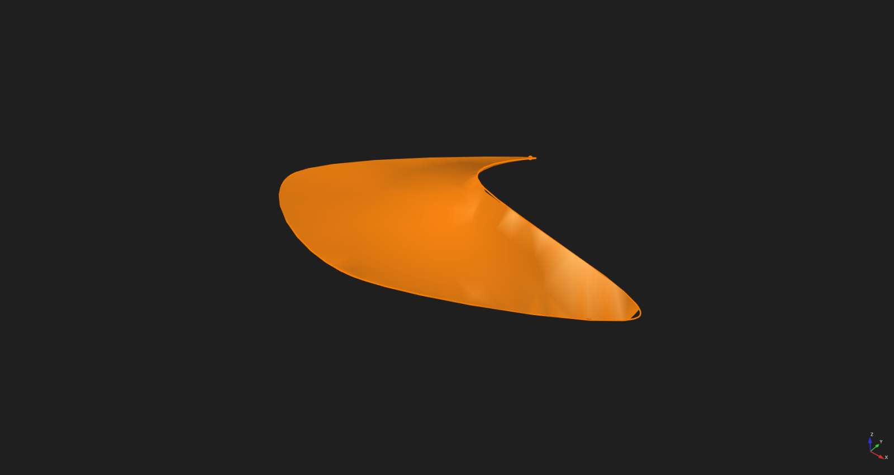
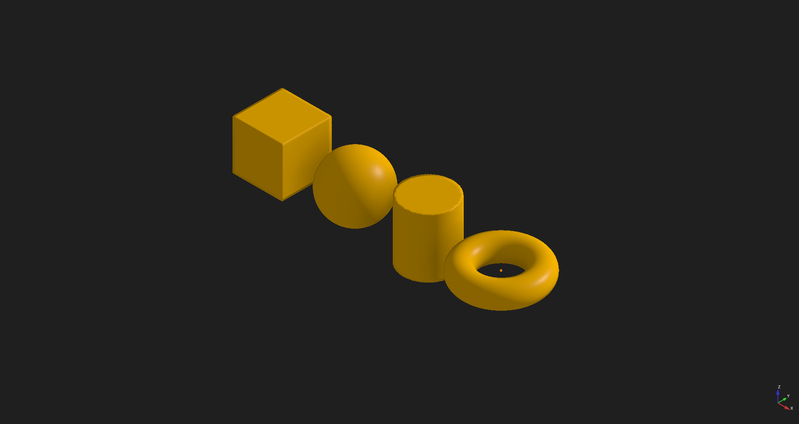
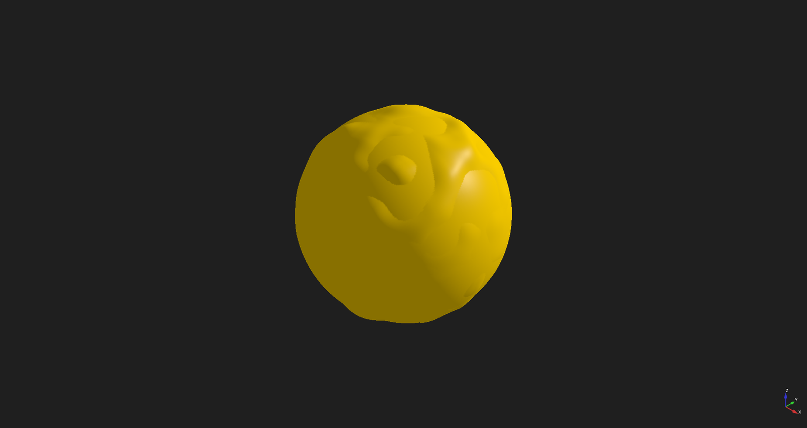
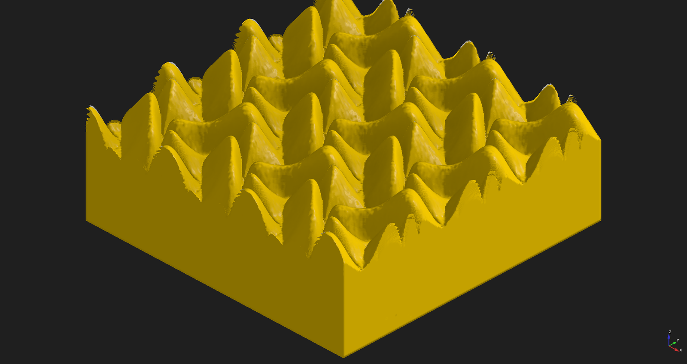
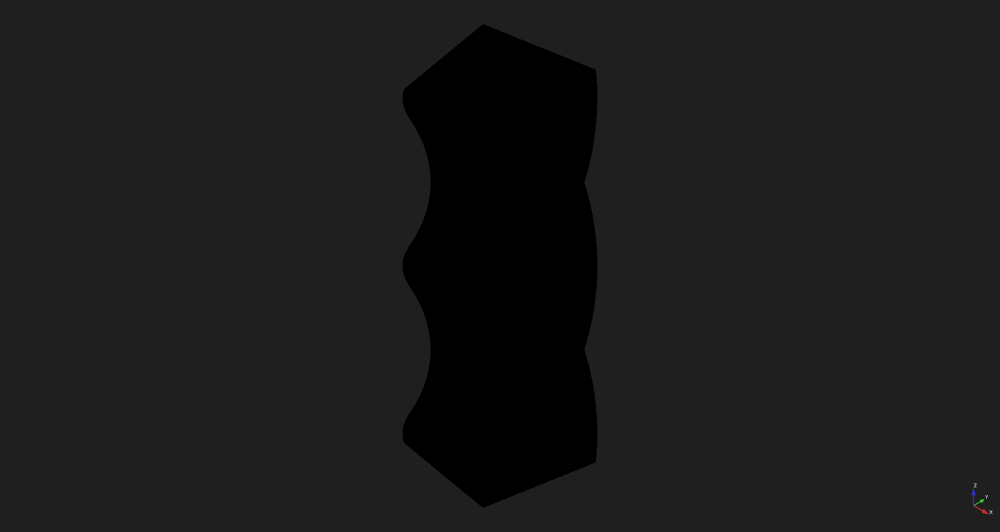
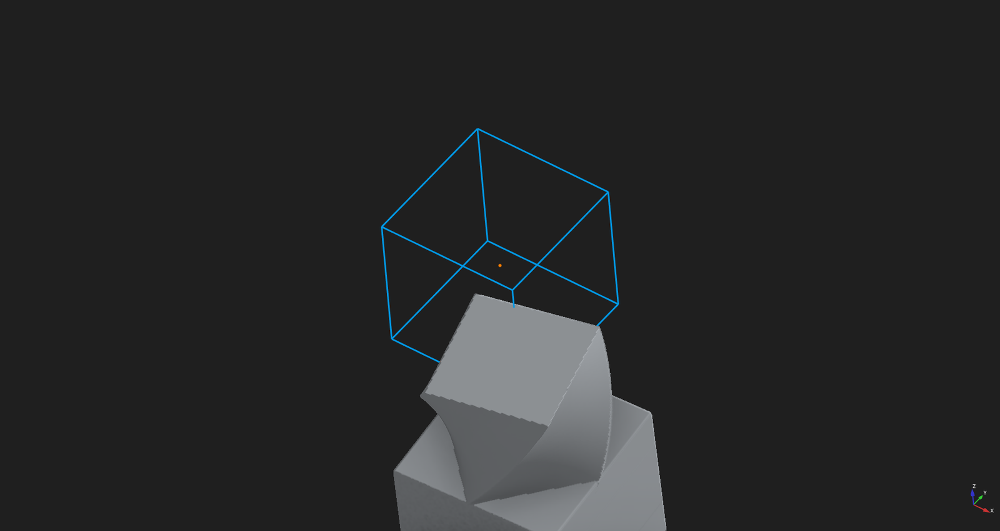
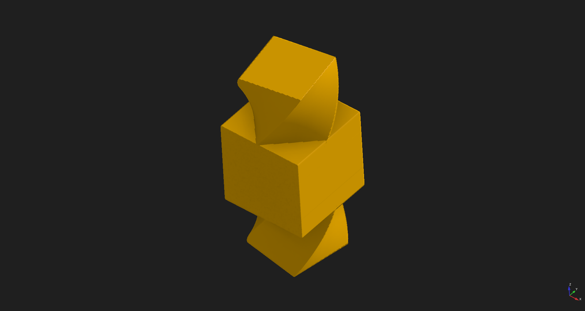
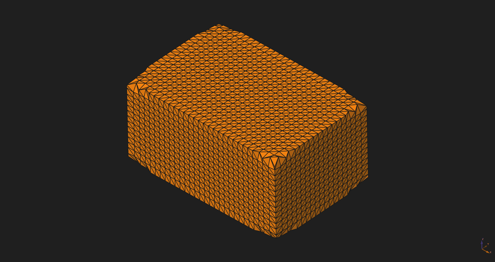
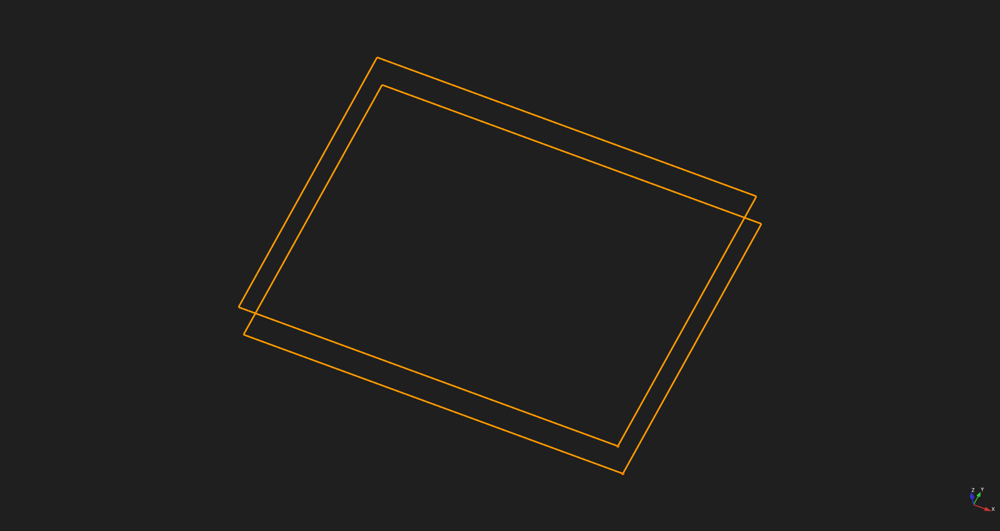
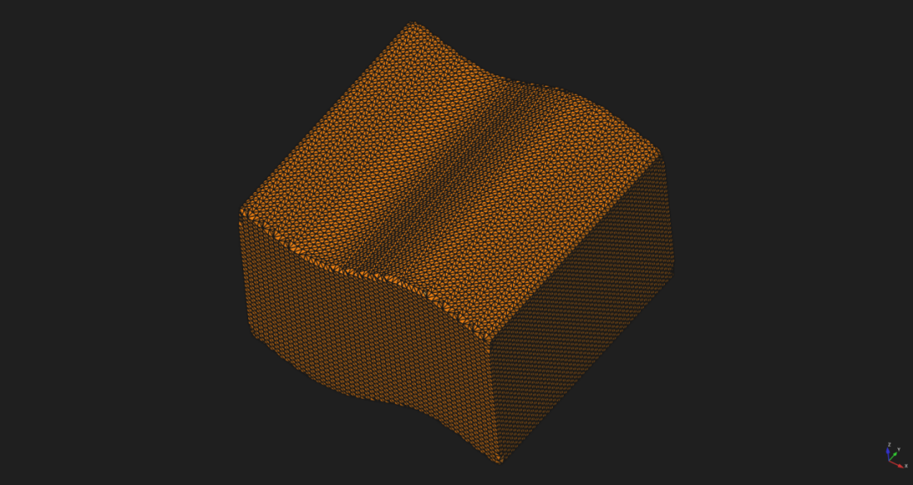

# Fields Workbench

The **Fields Workbench** brings implicit modeling, procedural textures, and volumetric deformation to FreeCAD using Signed Distance Fields (SDF). While traditional CAD relies on stitched boundary surfaces and brittle B-Rep booleans that can fail on complex intersections, Fields represents shapes as continuous volumetric fields. This makes it possible to blend intersecting solids with smooth transitions, carve and sculpt with 3D brushes, displace surfaces with procedural noise and heightmaps, and deform geometry with lattices and cages—all evaluated cleanly without topological errors, and convertible back to standard meshes or sliced into 2D curves for downstream FreeCAD operations.

## Tools

### Primitives

Creates exact mathematical solids—box, sphere, cylinder, and torus—with live-editable parameters. Use them as the building blocks for boolean operations, blends, and deformers.

### Procedural Noise

Adds procedural 3D noise directly to the surface of any SDF solid. Use it to create organic textures, knurling, or rough surface finishes.

### Heightmap Displacement

Displaces the surface of an SDF object using imported grayscale images or elevation data. Use it to emboss logos, textures, and terrain with adjustable depth and smoothing.

### Spatial Deformers

Non-destructively bends, twists, or repeats any SDF solid in a linear or polar array. Reach for these when shaping flowing, curved, or repetitive organic geometry.

### Lattice and Cage Deform

Encloses any SDF solid within an interactive 3D control cage or lattice. Moving cage vertices deforms the underlying volume, making it easy to sculpt ergonomic contours and complex silhouettes.

### Voxel Sculpt

Converts an SDF solid into an editable voxel volume that you can add and carve using 3D brushes. Use it for freeform digital clay sculpting with adjustable brush radius, strength, and falloff.

### SDF to Shape

Creates a Part solid from implicit fields using Surface Nets, Marching Cubes, or Dual Contouring. Use FreeCAD's standard export to save STL/OBJ files for 3D printing or downstream solid modeling.

### Slice SDF

Cuts an SDF solid with a cutting plane to extract 2D cross-section contour curves as native FreeCAD BSplineCurves. Use it for CNC toolpath generation, laser cutting, or sketching profiles.

## Requirements

- FreeCAD 1.1 or newer
- Fields requires no external dependencies beyond what FreeCAD bundles.

## Installation

**Addon Manager (recommended):** Tools → Addon manager → search for "Fields" → Install, then restart FreeCAD.

**Manual:** Clone or download https://github.com/StevePeters-US/Freecad-Fields-Workbench into the `Mod` folder of your FreeCAD user data directory (the Python console prints it: `App.getUserAppDataDir()`), then restart FreeCAD.

## Quick start

Geometry creation snaps to a dynamic workplane: hover over a face to align normal to the surface, or hover in empty space to use the camera-facing viewport plane. The first click locks the plane in place.

1. Switch to the **Fields** workbench from the workbench selector.
2. Click **Create Box** on the constructive toolbar, then click in the 3D viewport to place an SDF box.
3. With the box selected, click **Add Noise Modifier** to add procedural surface texture, and adjust the noise scale in the task panel.
4. Click **SDF to Shape** to convert the procedural solid into a Part solid ready for export.

Alternatively, open `Resources/examples/Fields.FCStd` to explore pre-built examples of blends, deformers, and sculpted volumes.

### Keyboard

**Object Selection / Navigation**

| Key | Action |
|---|---|
| `Tab` / `E` | Enter edit mode for the selected object |
| `Q` | Toggle Group 1 (Additive) ↔ Group 2 (Subtractive) |
| `D` | Open Fields context menu (or right-click) |
| `Ctrl + Space` | Toggle viewport maximize |

**While a Tool is Active**

| Key | Action |
|---|---|
| `Esc` | Cancel tool and restore original state |
| `Enter` | Commit and finish tool |
| `Tab` | Exit edit mode / close tool |
| `X` / `Y` / `Z` | Constrain movement to world X, Y, or Z axis |
| `Shift + X/Y/Z` | Constrain movement to perpendicular plane (`Shift+Z` → XY plane) |
| `D` | Tool options menu |

**Modal Transforms (Blender-style)**

Press `G`, `R`, or `S` in edit mode. Middle-mouse view navigation remains live throughout:

| Key | Action |
|---|---|
| `G` | Grab (translate / move) |
| `R` | Rotate |
| `S` | Scale |
| `X` / `Y` / `Z` | Lock to axis |
| `Shift + X/Y/Z` | Lock to perpendicular plane |
| `0`–`9`, `.`, `-` | Type exact numeric value (mm, degrees, factor) |
| `Backspace` | Delete last typed digit |
| `Enter` or Left-Click | Apply transform |
| `Esc` or Right-Click | Cancel transform and restore original position |

## Known issues

- Active development: tools, underlying data structures, and file formats may change between releases. Backwards compatibility is not guaranteed across updates.
- Visual node graph editor for procedural noise is currently in progress.

## Support

If you find this workbench useful, consider supporting its development on [Patreon](https://www.patreon.com/cw/AttackPotato).

## License

CC BY-NC-SA 4.0 — see [LICENSE](LICENSE).

## Attributions

- **Inigo Quilez** ([iquilezles.org](https://iquilezles.org/)) — Foundational mathematical formulations for distance primitives, GLSL raymarching algorithms, and smooth boolean operators (`smoothMin`/`smoothMax`).
