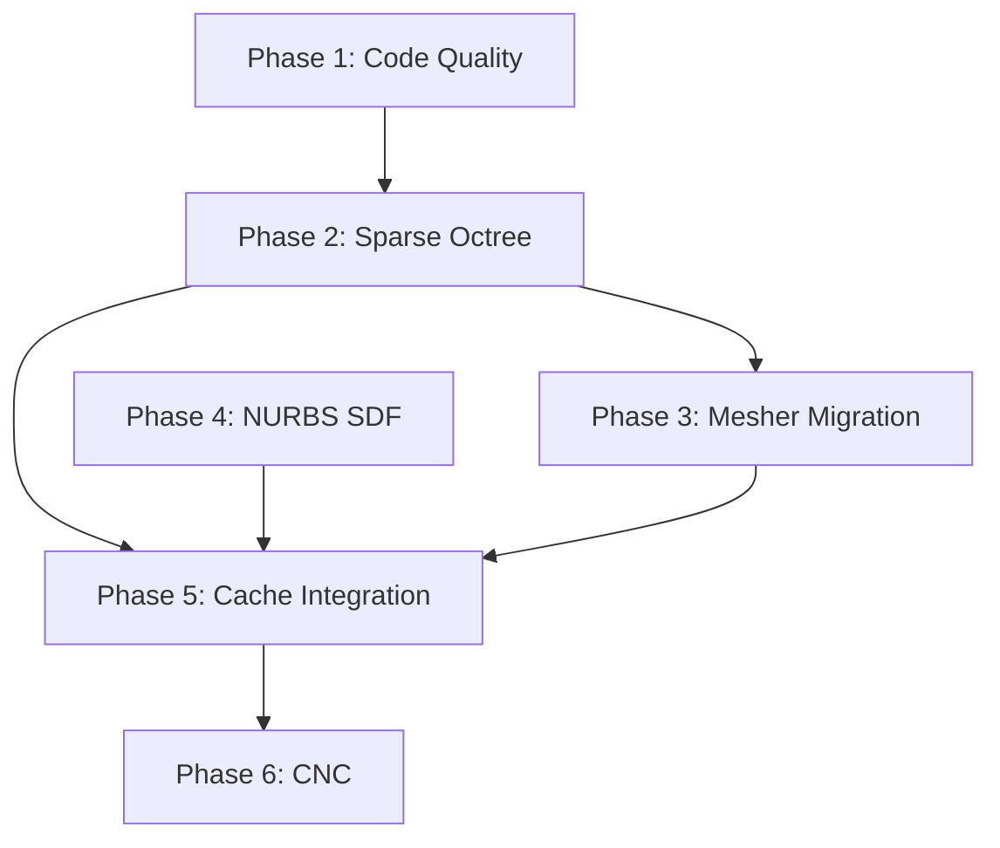

# Architecture Report: NURBS-Driven SDF Workbench — Full Audit & Task Generation Guide

> **Purpose**: This document is a comprehensive architecture review of the FreeCAD Direct Modeling workbench. It is written for an LLM agent to generate implementation tasks. It includes the project's vision, the current codebase state, every identified gap and code quality violation, and a phased roadmap to achieve the target architecture.

---

## 1. Project Vision

The Direct Modeling workbench implements **topology-free modeling** using Signed Distance Fields (SDFs) generated from NURBS geometry.

| Parameter | Target |
|-----------|--------|
| **Accuracy** | 0.05mm |
| **Work area** | 1m³ (1000mm × 1000mm × 1000mm) |
| **Source of truth** | NURBS points, curves, and surfaces |
| **Realtime preview** | GPU ray marching of **analytical** SDF formulas (no baked grids) |
| **CPU SDF access** | On-demand sparse cache for tools (slicing, meshing, hit-test) |
| **Storage** | NURBS control points only — SDF is ephemeral, never serialized |

### Why This Matters

At 0.05mm resolution over 1m³, a dense uniform grid would require **20,000³ = 8 trillion voxels** (32 TB of float32). This is physically impossible. The architecture must enforce that:

1. **GPU preview** uses analytical GLSL formulas — zero memory overhead.
2. **CPU tools** generate SDF values **only in a narrow band** around the surface, using hierarchical (octree) or band-limited evaluation.
3. **No code path** ever constructs a full dense grid over the bounding box.

---

## 2. Current Architecture Inventory

### 2.1 What Works Well

| Component | File | Status |
|-----------|------|--------|
| **SDF Primitives** (Box, Sphere, Cylinder, Torus, Plane) | `core/sdf/sdf/*.py` | ✅ Fully analytical `evaluate()` + `to_glsl()` |
| **2D SDF Primitives** (Polygon, Circle, Box2D, BezierCurve) | `core/sdf/sdf2d/*.py` | ✅ Full `evaluate_2d()` + `to_glsl_2d()` |
| **Extrusion / Revolution** | `core/sdf/sdf_extrusion.py`, `sdf_revolution.py` | ✅ 2D profile → 3D field with placement transforms |
| **Boolean Composition** | `core/sdf/sdf_composer.py` | ✅ Union, Intersection, Subtraction, Smooth variants |
| **GLSL Compiler** | `core/sdf/glsl_compiler.py` | ✅ Compiles SDF tree → fragment shader |
| **Scene Ray March Renderer** | `core/dm_scene_ray_march_renderer.py` | ✅ Multi-pass SSAO, analytical GLSL, per-field AABB |
| **CPU Sphere-Trace Hit Test** | `core/sdf/sdf_field.py:ray_march()` | ✅ AABB slab test + sphere trace |
| **Curve Sampler** | `core/sdf/curve_sampler.py` | ✅ Discretizes NURBS curves to world-space points |
| **2D Slice Extraction** | `core/sdf/sdf_slicer.py` | ✅ Dual contouring marching squares on arbitrary planes |
| **Noise Modifier** | `core/sdf/sdf/noise.py` + `core/dm_noise_object.py` | ✅ fBm noise applied to any SDF |

### 2.2 What is Broken or Missing

| Issue | Severity | Files Affected |
|-------|----------|----------------|
| **Dense grid memory explosion** | 🔴 Critical | `dm_mesher.py` (4 meshers), `sdf_baker.py` |
| **No SdfNurbsSurfaceField** | 🔴 Critical | Missing — no way to create SDF from arbitrary NURBS surface |
| **No SdfNurbsCurveField** (3D) | 🟠 High | Missing — only 2D Bezier profile exists |
| **No sparse/octree CPU evaluator** | 🟠 High | Missing — all CPU paths use `np.meshgrid` |
| **Silent `except: pass` blocks** | 🟡 Medium | `work_plane.py:153`, `view_projector.py:454`, `input_manager.py:464` |
| **Known bugs** (3 unfixed) | 🟡 Medium | See §5 below |
| **`sdf_baker.py` uses `FreeCAD.Console.PrintMessage`** | 🟡 Medium | Should use `dm_logger` |
| **README folder structure out of date** | 🟡 Medium | Does not reflect actual file tree |

---

## 3. The Scaling Problem — Dense Grids

Every mesher and the baker build a full `np.meshgrid` over the field's bounding box. This is the single biggest architectural flaw.

### Where `np.meshgrid` Is Used

| File | Line | Context |
|------|------|---------|
| `core/dm_mesher.py` | 141 | `MarchingCubesMesher.mesh()` |
| `core/dm_mesher.py` | 285 | `AdaptiveMCMesher.mesh()` (coarse grid) |
| `core/dm_mesher.py` | 513 | `SurfaceNetsMesher.mesh()` |
| `core/dm_mesher.py` | 833 | `DualContouringMesher.mesh()` |
| `core/sdf/sdf_baker.py` | 55 | `bake_sdf_to_volume()` |
| `core/sdf/sdf_slicer.py` | 81 | `slice_sdf()` (2D grid — acceptable for 2D slicing) |

### Memory Impact at Target Scale

| Object Size | Cell Size | Grid Dimensions | Points | Memory (float32) |
|-------------|-----------|-----------------|--------|-------------------|
| 100mm cube | 1.0mm | 102³ | 1.06M | 4 MB |
| 100mm cube | 0.05mm | 2002³ | 8.02B | **32 GB** |
| 1000mm cube | 1.0mm | 1002³ | 1.01B | **4 GB** |
| 1000mm cube | 0.05mm | 20002³ | 8.0T | **32 TB** |

The current meshers work at coarse cell sizes (1–5mm) but will crash at target resolution.

---

## 4. Target Architecture: Two Pipelines

The workbench must maintain **two completely separate SDF evaluation strategies**:

```
                NURBS Geometry (Source of Truth)
                         │
            ┌────────────┴────────────┐
            │                         │
    ┌───────▼────────┐       ┌────────▼────────┐
    │  GPU Analytical │       │  CPU On-Demand  │
    │  (Realtime)     │       │  (Sparse Cache) │
    └───────┬────────┘       └────────┬────────┘
            │                         │
    to_glsl() → GLSL          evaluate() → Octree
    Fragment Shader            narrow-band grid
            │                         │
    Ray March Renderer        Meshers, Slicers,
    (instant, 0 memory)       Hit-test, Export
```

### 4.1 GPU Pipeline (Already Working for Primitives)

The GPU pipeline compiles the `SdfField` tree to GLSL via `to_glsl()`, builds a multi-field fragment shader via `build_multi_raymarch_fragment_shader()`, and renders with `DMSceneRayMarchRenderer`. This pipeline:

- Uses **zero CPU memory** for SDF storage
- Handles unlimited resolution (fragment-level evaluation)
- Already supports primitives, extrusions, revolutions, booleans, noise
- **Gap**: No `to_glsl()` for arbitrary NURBS curves/surfaces

### 4.2 CPU Pipeline (Needs Complete Rework)

The CPU pipeline is used by:
- **Meshers** (`dm_mesher.py`): SDF → triangle mesh for export
- **Slicer** (`sdf_slicer.py`): SDF → 2D contour curves
- **Baker** (`sdf_baker.py`): SDF → 3D texture (used by legacy baked renderer)
- **Hit-test** (`sdf_field.py:ray_march()`): CPU sphere-trace (already sparse — OK)

**The meshers and baker must be rewritten** to use hierarchical (octree) evaluation that:
1. Starts from the bounding box
2. Recursively subdivides only cells that contain the surface
3. Evaluates `field.evaluate_grid()` only on leaf cells near the zero-crossing
4. Scales with surface area, not volume

---

## 5. Known Bugs

| ID | File | Bug | Impact |
|----|------|-----|--------|
| BUG-1 | `core/input_manager.py` | `get_projected_point()` returns undefined variable `result` | Crash on call |
| BUG-2 | `tools/edit_tool.py` | `_hit_test_edge` references `event_dict` (not a parameter); also missing `import Part` | Crash on edge hit-test |
| BUG-3 | `core/input_manager.py` | E-key handler only dispatches `EditTool` for `curve` ShapeType; `SdfEditTool` unreachable via E-key | SDF edit mode broken |

---

## 6. Code Quality Violations

### 6.1 Silent Exception Swallowing

Per project rules, every `except` block **must** log via `dm_logger`. These locations violate that rule:

| File | Line | Code |
|------|------|------|
| `core/work_plane.py` | 153 | `except: pass` |
| `core/view_projector.py` | 454 | `except: pass` |
| `core/input_manager.py` | 464 | `except: pass` |
| `core/dm_object.py` | 72 | `except: pass` (in `set_perf_profiler_enabled`) |

### 6.2 Logging Violations

| File | Line | Issue |
|------|------|-------|
| `core/sdf/sdf_baker.py` | 70–73 | Uses `FreeCAD.Console.PrintMessage()` directly instead of `dm_logger` |

### 6.3 README Drift

The `README.md` folder structure (lines 74–129) does not match the actual codebase:
- Lists `sdf_mesher.py` but the actual file is `dm_mesher.py`
- Lists `field_composer.py` but the actual file is `sdf_composer.py`
- Lists `primitives/` subdirectory but the actual path is `core/sdf/sdf/`
- Missing many actual files: `gl_compute.py`, `gl_framebuffer.py`, `gl_program.py`, `gl_texture3d.py`, `dm_ray_march_renderer.py`, `dm_noise_object.py`, `dm_gizmo.py`, etc.
- Missing entire `core/sdf/sdf2d/` subdirectory
- Missing `sdf_extrusion.py`, `sdf_revolution.py`, `sdf_slicer.py`
- Missing `noise_tool.py`, `cmd_noise.py`, `cmd_curve_sdf.py`, `cmd_sdf_export.py`, `cmd_sdf_slice.py`
- Toolbar status table is stale (Box, Sphere, Cylinder show "Planned" but are implemented)

---

## 7. Phased Task Roadmap

### Phase 1: Code Quality & Bug Fixes

> Clean up the foundation before adding new features.

| Task | Description | Files |
|------|-------------|-------|
| **CQ-001** | Fix all 3 `except: pass` blocks — add `dm_logger.debug()` | `work_plane.py`, `view_projector.py`, `input_manager.py` |
| **CQ-002** | Fix `set_perf_profiler_enabled` bare except — add `dm_logger.debug()` | `dm_object.py` |
| **CQ-003** | Replace `FreeCAD.Console.PrintMessage` with `dm_logger.info` in `sdf_baker.py` | `sdf_baker.py` |
| **CQ-004** | Fix BUG-1: `get_projected_point()` undefined `result` | `input_manager.py` |
| **CQ-005** | Fix BUG-2: `_hit_test_edge` missing `event_dict` param + `import Part` | `edit_tool.py` |
| **CQ-006** | Fix BUG-3: E-key handler — add `SdfEditTool` dispatch for SDF shapes | `input_manager.py` |
| **CQ-007** | Update README.md folder structure to match actual codebase | `README.md` |
| **CQ-008** | Update README.md toolbar status table (Box/Sphere/Cylinder are implemented) | `README.md` |

### Phase 2: Sparse CPU Evaluation Infrastructure

> Replace dense grids with hierarchical evaluation. This is the prerequisite for all downstream CPU tools at target scale.

| Task | Description | Files |
|------|-------------|-------|
| **SP-001** | Create `SdfOctreeCache` class — top-down octree evaluator that recursively subdivides from bounding box to `leaf_size`, culling cells where `abs(SDF_center) > cell_diagonal` (guaranteed empty/full). Store leaf cell corner values in a flat hash map keyed by `(level, ix, iy, iz)`. | New: `core/sdf/sdf_octree.py` |
| **SP-002** | Add `SdfOctreeCache.query(point) → float` — trilinear interpolation from cached leaf corners. Return `+inf` for points in culled (empty) space. | `core/sdf/sdf_octree.py` |
| **SP-003** | Add `SdfOctreeCache.walk_leaves(callback)` — iterator over all surface-crossing leaf cells with their corner values and positions. This is the mesher's input. | `core/sdf/sdf_octree.py` |
| **SP-004** | Add `SdfOctreeCache.narrow_band_points(band_width) → (N,3)` — return all grid points within `band_width` of the surface. This replaces `np.meshgrid` for meshers. | `core/sdf/sdf_octree.py` |

### Phase 3: Mesher & Baker Migration

> Rewrite all consumers of dense grids to use `SdfOctreeCache`.

| Task | Description | Files |
|------|-------------|-------|
| **MG-001** | Rewrite `MarchingCubesMesher.mesh()` to accept an `SdfOctreeCache` and iterate only over surface-crossing leaf cells. Remove `np.meshgrid`. | `dm_mesher.py` |
| **MG-002** | Rewrite `SurfaceNetsMesher.mesh()` similarly. The relaxation loop should use `SdfOctreeCache.query()` instead of `evaluate_grid()` on a dense array. | `dm_mesher.py` |
| **MG-003** | Rewrite `DualContouringMesher.mesh()` similarly. QEF accumulation iterates over octree leaves, not a dense grid. | `dm_mesher.py` |
| **MG-004** | Remove or rewrite `AdaptiveMCMesher` — it is now redundant since the octree itself provides adaptivity. Either delete it or make it a thin wrapper over `MarchingCubesMesher` + `SdfOctreeCache` with variable leaf depth. | `dm_mesher.py` |
| **MG-005** | Rewrite `bake_sdf_to_volume()` to use `SdfOctreeCache` for filling only the narrow-band voxels. Out-of-band voxels get `max_dist` (positive). This preserves the baked renderer path for small objects. | `sdf_baker.py` |
| **MG-006** | Update `cmd_sdf_export.py` to create an `SdfOctreeCache` at the user's requested resolution and pass it to the mesher. | `cmd_sdf_export.py` |

### Phase 4: NURBS → SDF Generalization

> Enable arbitrary NURBS curves and surfaces to produce SDF fields.

| Task | Description | Files |
|------|-------------|-------|
| **NS-001** | Create `SdfNurbsCurveField(SdfField)` — CPU evaluation: given a 3D NURBS curve (from `DMCurve.bspline`), compute signed distance at any point. Use the BSpline `NearestParameter` API to find closest point, then compute distance. Sign determination via cross-product with curve tangent and a reference normal. | New: `core/sdf/sdf/nurbs_curve.py` |
| **NS-002** | Create `Sdf2dNurbsCurveField(Sdf2dField)` — 2D version for profiles. Given a 2D BSpline, compute signed distance using winding number for sign and BSpline `NearestParameter` for distance. | New: `core/sdf/sdf2d/nurbs_curve.py` |
| **NS-003** | Create `SdfNurbsSurfaceField(SdfField)` — CPU evaluation: given a NURBS surface (from `Part.BSplineSurface`), compute signed distance. Use surface `UVProjPoint` for closest-point queries, sign from surface normal dot product. | New: `core/sdf/sdf/nurbs_surface.py` |
| **NS-004** | Add `to_glsl()` for `SdfNurbsCurveField` — pass control points as uniforms, implement iterative Newton-Raphson closest-point search in GLSL (similar to existing `sd_cubic_bez_2d` but generalized to arbitrary degree BSplines). | `core/sdf/sdf/nurbs_curve.py` |
| **NS-005** | Add `to_glsl_2d()` for `Sdf2dNurbsCurveField` — GLSL 2D signed distance to arbitrary BSpline profile. Consider converting high-degree BSplines to piecewise cubic Bezier segments and reusing `sd_cubic_bez_2d`. | `core/sdf/sdf2d/nurbs_curve.py` |
| **NS-006** | Add `to_glsl()` for `SdfNurbsSurfaceField` — This is the hardest task. Two viable approaches: (A) Discretize the surface to a triangle proxy and compute distance to triangles in GLSL, or (B) Pass control point grid as a uniform buffer and implement iterative Newton projection in GLSL. Recommend approach (A) for initial implementation. | `core/sdf/sdf/nurbs_surface.py` |
| **NS-007** | Wire up the NURBS SDF fields to the `DMObjectProxy` — when a curve or surface object exists, auto-generate an `SdfNurbsCurveField` or `SdfNurbsSurfaceField` and register it with `DMSceneRayMarchRenderer`. | `dm_object.py` |
| **NS-008** | Add a `NurbsProfileExtrusion` convenience tool — given a closed NURBS curve on a workplane, create an `SdfExtrusionField` using a `Sdf2dNurbsCurveField` profile. This generalizes the existing `CurveSdfTool`. | `commands/cmd_curve_sdf.py` |

### Phase 5: Pipeline Integration & Caching

> Wire the sparse evaluation into all tool paths.

| Task | Description | Files |
|------|-------------|-------|
| **PI-001** | Create `SdfCacheManager` — singleton that holds `SdfOctreeCache` instances keyed by field identity. Invalidates cache when field parameters change. Tools request a cache at a specific resolution; the manager creates or returns an existing one. | New: `core/sdf/sdf_cache_manager.py` |
| **PI-002** | Update `sdf_slicer.py` to optionally accept a pre-built `SdfOctreeCache`. If provided, sample from the cache instead of calling `evaluate_grid()` on a dense 2D meshgrid. (The 2D meshgrid is acceptable for slicing, but cache lookup would be faster for repeated slices.) | `sdf_slicer.py` |
| **PI-003** | Update `ray_march()` on `SdfField` to optionally accept an `SdfOctreeCache` for AABB-accelerated sphere tracing. Skip evaluating `field.evaluate()` when the cache says a region is empty. | `sdf_field.py` |
| **PI-004** | Add a progress callback to `SdfOctreeCache.build()` — octree generation at 0.05mm over a 1m³ object will take minutes. Tools must show a progress bar. | `sdf_octree.py` |

### Phase 6: Future — CNC & Advanced Operations

> Longer-term goals enabled by the analytical SDF architecture.

| Task | Description |
|------|-------------|
| **CNC-001** | Implement `isosurface_at(offset)` — tool-radius compensation by evaluating `f(p) = r` instead of `f(p) = 0` |
| **CNC-002** | Implement `gouge_check(tool_path, radius)` — verify `f(p) >= r` along a polyline path |
| **CNC-003** | Implement `z_slice_contours(z, radius)` — 2D roughing boundaries at height `z` for tool radius `r` |
| **CNC-004** | Implement `curvature_map(surface_points)` — Hessian-based principal curvatures for adaptive scallop height |

---

## 8. Dependency Graph



Phase 4 (NURBS SDF) can proceed **in parallel** with Phases 2–3, since it only adds new `SdfField` subclasses without modifying existing meshers.

---

## 9. Prompt for Task-Generating LLM

**Project**: FreeCAD Direct Modeling Workbench — topology-free SDF modeling at 0.05mm / 1m³

**Source of Truth**: NURBS geometry (points, curves, surfaces) stored as `Part::FeaturePython` properties

**Two Pipelines**:
1. **GPU Analytical** — `to_glsl()` → GLSL fragment shader → `DMSceneRayMarchRenderer` (instant, zero memory)
2. **CPU Sparse** — `evaluate()` → `SdfOctreeCache` → narrow-band grid → Meshers/Slicers/Export (on-demand, scales with surface area)

**Key Constraint**: No code path may ever construct a dense 3D grid over the full bounding box. All CPU evaluation must be hierarchical.

**Existing Working Code**: SDF primitives, 2D profiles, extrusion/revolution, boolean composition, GLSL compiler, multi-pass SSAO ray march renderer, CPU sphere-trace hit-test, 2D slicer, curve sampler.

**What's Missing**: Sparse octree evaluator, NURBS surface/curve SDF fields, NURBS GLSL shaders, mesher migration to sparse input, cache manager.

**Code Conventions**: Use `dm_logger` (never `print()`), defer all doc mutations via `QTimer.singleShot(0, fn)`, every `except` must log.

**Task Format**: Use the project's `dm_todo_format` skill — task IDs like `SP-001`, dependency chains, clear acceptance criteria, file paths.

**Generate tasks for Phases 1–5 above.** Phase 6 is aspirational and does not need tasks yet.
